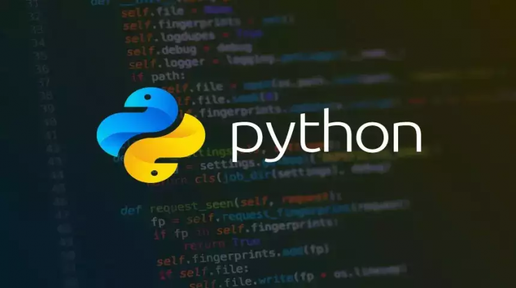

# python pomodoro timer for developers

This post is about a Pomodoro timer script that was created specifically for developers so they can have a break between work. Stay tuned with us.

---

# Features:
1. Error Handling
2. exact time
3. input management
4. notification send
5. Just run in Linux System

---
# Description:

This code connects to your Linux terminal and implements the Pomodoro Rule, preventing fatigue while working.

---

# Run code:
```bash
sudo apt install python3 # if not exists

# 2
python3 timer.py
```
---
# Simplifying the same code by doing the same thing
```python
import os
import time

while True:
    os.system('notify-send "Time to have some tea or coffee and rest for a few minutes. Don't be tired"')
    time.sleep(1500)
```
**But this code is not accurate and does not have specific management.**
---
# -👤Created By GodFather 

# -📜MTA Scripter • Linux Learner🐧 • python Learning Developer • Bash Scripter • Sql •🇺🇸🔥
---
**Topics:** 
[#Bash](https://github.com/topics/bash) •
[#Linux](https://github.com/topics/linux) •
[#Automation](https://github.com/topics/automation) •
[#Python](https://github.com/topics/python)
---

